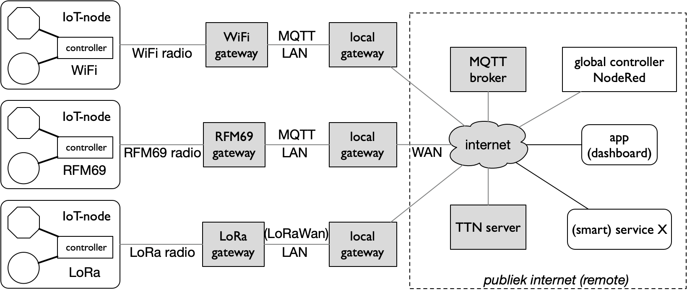

Verbindingsapparaten
====================

In het vorige hoofdstuk hebben we kennis gemaakt met de *functionele bouwstenen* van de IoT-keten.
Vanuit het netwerk bezien zijn dit *eindapparaten*.
In dit hoofdstuk gaan we in op de bouwstenen voor de communicatie.

We beschrijven hier de algemene principes.
In de volgende hoofdstukken werken we deze uit voor een aantal concrete IoT-ketens.
De nadruk ligt daarbij vooral op de rand (*edge*) van de IoT-keten:
de verbinding tussen de IoT-knopen en het internet.

.. figure:: IoT-keten-communicatie.png
    :width: 600px
    :align: center

    IoT-keten met verbindingsapparaten

In de bovenstaande figuur zie je de IoT-keten uitgebreid met apparaten voor de communicatie:

* de IoT-knoop heeft een *IoT-radioverbinding* met de *IoT-gateway*;
* de *IoT-gateway* zorgt enerzijds voor de radiocommunicatie met de IoT-knoop,
  en anderzijds voor de verbinding met lokale netwerk (LAN);
* de *lokale gateway* zorgt voor de verbinding tussen het lokale netwerk (LAN) en het internet
  - via het wide-area netwerk (WAN) van de internet service provider (ISP);
* de *MQTT-broker* zorgt voor de MQTT-verbinding tussen de IoT-knopen,
  de controllers en de apps in het publieke internet;

In deze figuur zijn de fysieke communicatieverbindingen getekend:

* de IoT-radioverbinding tussen IoT-knoop en IoT-gateway;
* het lokale netwerk (LAN), met daarin de lokale controller;
* het publieke internet - verbonden via het wide area network (WAN) van de internet service provider;
* met daaraan verbonden de MQTT broker, de globale controller, de app(s) en de diensten (in de "cloud").

De keten is opgebouwd uit een *lokaal deel* en een deel op afstand (*remote*), via het publieke internet.
De MQTT-broker, de globale controller en de diensten zijn vaak "in the cloud",
via grote servercentra ("server farms") in het internet.

IoT-radio
---------

In veel gevallen willen we gebruik maken van IoT-knopen die mobiel zijn en/of niet gemakkelijk van een netvoeding voorzien kunnen worden.
We hebben dan een draadloze (radio-)verbinding nodig in combinatie met een batterij.
Om de batterij niet te groot te maken gebruiken we bij voorkeur een energiezuinige radio.
Voor veel Iot-toepassingen werken we bovendien met radio's in licentievrije frequentiebanden,
bijvoorbeeld rond 2.4 Ghz, 5 Ghz, 818MHz, 430 MHz.
Voorbeelden van dergelijke radio's zijn: WiFi, Bluetooth (in het bijzonder BLE: Bluetooth Low Energy),
ZigBee, RFM69, LoRa, SigFox, e.d.

.. figure:: IoT-radio-vergelijking.png
    :width: 500px
    :align: center

    Vergelijking tussen verschillende IoT-radio's

Een dergelijke IoT-radio heeft meestal de volgende beperkingen:

- het zendvermogen is beperkt (zowel vanwege de beperkte batterij als vanwege de gebruikte frequentieband);
- het bereik is beperkt, en/of
- de bitrate (bits/s dat verstuurd kan worden) is beperkt, en/of
- het bereik (de afstand waarover berichten betrouwbaar ontvangen kunnen worden) is beperkt.

In het algemeen geldt dat bij gelijk zendvermogen, je kunt kiezen tussen een groter bereik of een grotere bitrate.
Voor het versturen van bits over een grotere afstand heb je meer energie per bit nodig.

In de volgende hoofdstukken werken we voorbeelden uit voor enkele van deze IoT-radio's:
WiFi, RFM69, en LoRa. (Mogelijk dat we in de toekomst daar nog 1 of 2 voorbeelden aan toevoegen.)

IoT-gateway
-----------

Voor de verbinding tussen de IoT-knoop en het lokale netwerk (LAN) hebben we een *gateway* nodig.
Deze heeft vaak twee functies:

* fysieke verbinding tussen beide netwerken;
* zo nodig: conversie tussen de protocollen van beide netwerken.

    3 verschillende IoT-gateways met hun verbindingen

Als de IoT-knoop over WiFi beschikt, fungeert het WiFi-basestation als gateway.
Voor de RFM69- en LoRa-radio's zijn afzonderlijke gateways nodig.
Je hoeft niet altijd zelf een LoRa-gateway te hebben.
Als je gebruik maakt van een LoRaWan-netwerk van KPN of TTN (TheThingsNetwork) is het voldoende als er een gateway in de buurt staat.
net als een mobiele zendmast voor het mobiele netwerk.

LAN-gateway
-----------

De LAN-gateway verzorgt de verbinding tussen het lokale netwerk (LAN) en het internet,
via het wide-area network (WAN) van de internet service provider (ISP).
Vaak is deze gateway gecombineerd met andere functies, zoals die van firewall, lokale router en WiFi-basestation.

Meestal is een LAN-gateway voor thuisgebruik een zogenaamde NAT-router:
dit staat voor "Network Address Translation".
Het lokale netwerk gebruikt dan geen echte (publieke) internetadressen,
maar lokale (of "private") adressen van de vorm 192.169.xxx.xxx, 10.xxx.xxx.xxx, 172.xxx.xxx.xxx.
De LAN-gateway heeft zelf één enkel publiek internetadres.
"Network Address Translation" betekent dat de LAN-gateway deze lokale adressen omzet naar dit publieke interadres,
en omgekeerd.

zie: https://nl.wikipedia.org/wiki/Network_address_translation, https://en.wikipedia.org/wiki/Network_address_translation

Een gevolg is dat computers in het lokale netwerk niet direct bereikbaar zijn vanuit het publieke internet.
Dit betekent dat ook de IoT-knopen en/of de IoT-gateway niet direct bereikbaar is.

In de voorbeelden die we in de latere hoofdstukken uitwerken gebruiken we een MQTT-broker (server) in het publieke internet.
Via het MQTT-protocol en deze broker kunnen we zowel "van binnen naar buiten" als "van buiten naar binnen" communiceren.

MQTT-broker
-----------

Het internet of things is niet zo gestandaardiseerd als het web:
er zijn veel verschillende protocollen waar je uit kunt kiezen.

.. figure:: MQTT-IoT.png
    :width: 500px
    :align: center

    MQTT als publish-subscribe protocol

Een veel-gebruikt IoT-protocol is MQTT (MQ Telemetry Transport): dit biedt beveiligde en (desgewenst) betrouwbare communicatie van berichten.
Voor veel IoT-toepassingen zijn deze berichten vrij klein: enkele tientallen tot enkele honderden bytes.
MQTT kan deze efficiënt verwerken.
MQTT is een zogenaamd *publish-subscribe* protocol.
Een client kan zich abonneren op alle berichten van een bepaald topic (of kanaal).
En een client kan berichten publiceren met een bepaald topic.
De broker zorgt voor het doorsturen van de berichten tussen de clients.
Er is daarbij geen verschil tussen een IoT-knoop, een app of een cloud-service als client.

Routers
-------

Het internet verbindt computernetwerken tot een wereldwijd netwerk.
Het internet gebruikt daarvoor een reeks protocollen, vaak aangeduid als de TCP/IP-stack.
Het basisprotocol van het internet, het IP-protocol,
zorgt voor de "best effort" communicatie van IP-pakketten tussen computers in het internet.
Een IP-router verbindt twee of meer netwerken.
Deze router zorgt ervoor dat de pakketten die geen lokale bestemming hebben,
een stap dichter bij hun bestemming komen.

Rest
----

Het verschil is niet alleen de afstand tot de IoT-knoop.
Zoals we later zullen zien blokkeert de lokale gateway, tussen het lokale netwerk en het internet,
directe communicatie van buiten naar binnen:
je kunt wel vanuit het lokale netwerk servers in het publieke internet bereiken,
maar andersom kun je vanuit het publieke internet de computers in het lokale netwerk niet bereiken.
Dit betekent bijvoorbeeld dat een app op je smartphone mogelijk wel werkt in het lokale netwerk (als je thuis bent),
maar niet vanuit het mobiele netwerk (als je onderweg bent).
Met behulp van de MQTT-broker kunnen we dit laatste wel weer mogelijk maken.

Kleine variaties op dit thema, met alternatieven voor de MQTT-broker:

* voor de Hue-toepassing (slimme verlichting) combineert de Hue-bridge de functies van gateway en lokale controller;
  de Hue-server in het publieke internet zorgt voor de communicatie met enerzijds deze bridge,
  en anderzijds de apps en eventueel andere diensten in het publieke internet;
* in het geval van TheThingsNetwork verzorgt de TTN-server de communicatie met enerzijds de TTN-gateway(s),
  en anderzijds de apps en andere diensten in het publieke internet.

Vraag: waarom heb je een server in het publieke internet, zoals een MQTT-broker,
nodig om vanuit een app overal te kunnen communiceren met de IoT-knopen thuis?
- de lokale gateway (router/firewall) staat geen directe communicatie van buiten naar het lokale netwerk toe;
- de afstand tussen de app en de IoT-knopen kan te groot zijn om deze zonder een dergelijke tussenstap te overbruggen;
- het formaat van de berichten van de IoT-knopen is niet geschikt voor de app op je smartphone;
- (vergroot de snelheid; vergroot de veiligheid?)
