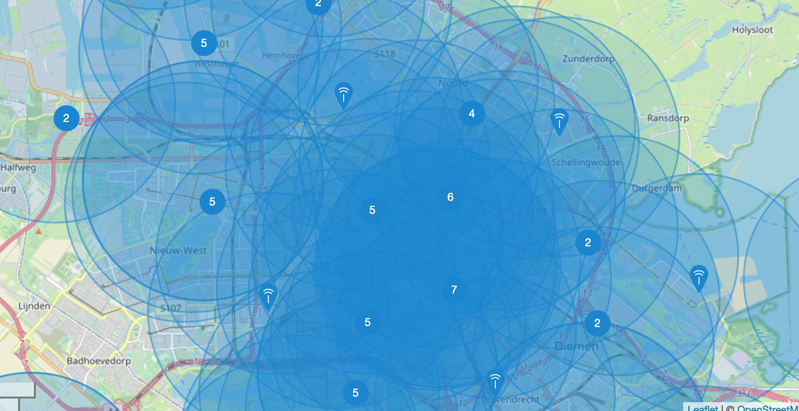

Voordelen van LoRaWan
---------------------

De belangrijkste voordelen van LoRaWan zijn:

* dekking van het netwerk in een groot gebied (“wide area network”, WAN),
  door het gebruik van LoRa (long range) radio.
* mobiele IoT-devices: een IoT-device is niet gebonden aan een gateway,
  berichten kunnen door meerdere gateways ontvangen worden.
* locatiebepaling door het combineren van gateway-ontvangstdata.
* lange batterijlevensduur:
  door het lage energieverbruik van de LoRa radio gaat de batterij van device vaak jarenlang mee.
* veiligheid: de LoRaWan-berichten worden end-to-end versleuteld met een 128-bit AES-key.
