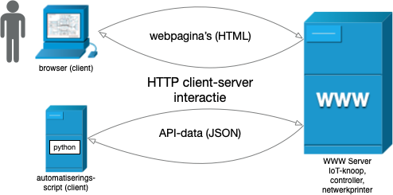

API's voor IoT-apparaten
------------------------

  Apparaat of toepassing met webpagina's en een web-API

Je kunt als menselijke gebruiker apparaten met een webserver besturen vanuit de browser,
op basis van webpagina's (HTML).

Voor het besturen van een IoT-knoop *vanuit een ander programma* heb je een ander soort interface nodig:
een API (Application Programming Interface).
In principe kun je voor elk API een eigen protocol ontwerpen,
maar het is handig om het HTTP-protocol als basis te gebruiken.
Via zo'n web-API profiteer je van de hele web-infrastructuur.

Een web-API gebruikt als payload meestal JSON, in plaats van HTML:
JSON kun je eenvoudig in een intern object omzetten en omgekeerd.

Je kunt via zo'n web-API een apparaat in het lokale netwerk automatisch bewaken en besturen;
denk bijvoorbeeld aan een IoT-knoop, een controller (Hue bridge) of een netwerkprinter.
Je kunt hiervoor elke programmeertaal gebruiken, bijvoorbeeld Python.
Als je in een scriptingtaal HTTP-requests kunt opbouwen en versturen,
kun je daarmee ook toepassingen met web-API’s besturen.
