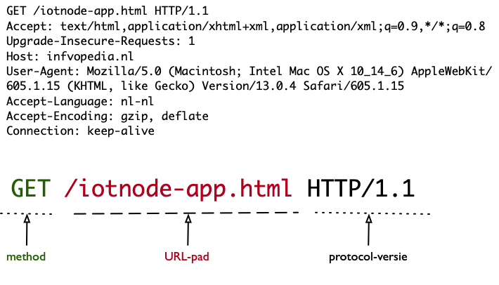

HTTP methods
============

   HTTP request - opvragen van http://infvopedia.nl/iotnode-app.html

Het eerste element van een HTTP-request is een *method-keyword*,
in dit voorbeeld ``GET``.
Deze method geeft aan hoe de server het URL-pad en eventuele extra data moet interpreteren.
De meest gebruikte methods zijn:

* GET - de client vraagt de server om een document ("representatie") voor de URL;
* HEAD - de client vraagt de server om de metadata (headers) voor de URL;
* POST - de client stuurt de server informatie over de URL - bijvoorbeeld de inhoud van een formulier;
* PUT - de client stuurt de server een document voor de URL;
* DELETE - de client verzoekt de server om de URL te verwijderen.

Als je een webpagina opvraagt, stuurt de browser een GET-request.
Bij het opsturen ("submit") van een ingevuld webformulier stuurt de browser een POST-request.
De webpagina zelf kan via de gebruikte JavaScript-code andere request-methods gebruiken.

REST-API's gebruiken deze methods op een speciale manier.

*Opmerking.* De methods GET en HEAD zijn bedoeld om gegevens van de server op te vragen,
niet om de toestand bij de server te veranderen.
Dit is een afspraak in het web-protocol:
een toepassing die zich niet aan deze regels houdt "speelt het spel niet netjes".
Dat kan op onverwachte momenten tegen zo'n toepassing werken.

.. rubric:: Idempotente methods

De methods GET, HEAD, PUT en DELETE zijn *idempotent*:
dat wil zeggen dat het geen verschil uitmaakt of je deze éénmaal of vaker achter elkaar
uitvoert.
Een browser heeft een speciale "reload" knop waarmee je de laatste GET nog een keer kunt uitvoeren:
dat kun je ongestraft doen.

De method POST is niet idempotent: dat is de reden dat de browser je
vraagt of je zeker weet dat je het formulier nog een keer wilt opsturen.
Een server kan dit bijvoorbeeld opvatten als het nogmaals bestellen van een artikel,
wat waarschijnlijk niet je bedoeling is.

Lees verder:

* https://nl.wikipedia.org/wiki/Hypertext_Transfer_Protocol
* https://developer.mozilla.org/en-US/docs/Web/HTTP/Methods
