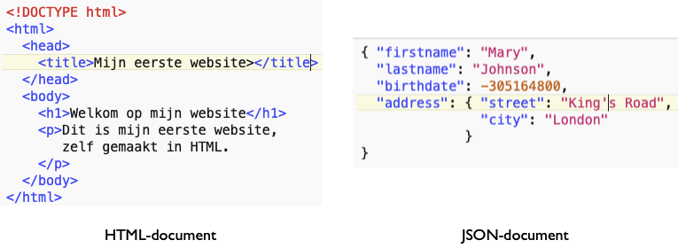

Payload
-------

   HTTP payload-voorbeelden

De belangrijkste payload voor het HTTP-protocol is een HTML-document.
Daarnaast kent HTTP allerlei andere soorten payloads,
zoals JavaScript- of CSS-bestanden of een PNG-figuur.
De meest gebruikte payload-formaten in web-API's zijn JSON en XML.

Soms stuurt de client gegevens naar de server,
bijvoorbeeld de inhoud van een ingevuld formulier.
Deze data kan als reeks (naam-waarde) paren meegegeven worden ("url-encoded"),
in JSON-formaat, of in een ander formaat.

Verder lezen:

* https://developer.mozilla.org/en-US/docs/Web/HTTP/Methods/POST
