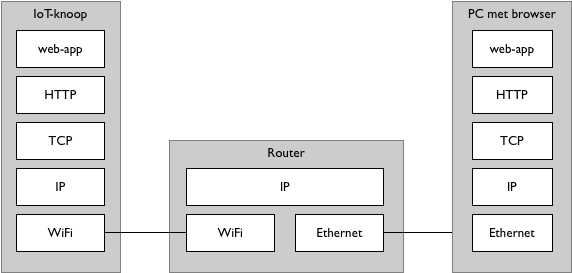

HTTP in de protocol-stack
-------------------------

   Webserver protocolstack

De protocolstack voor de webserver-keten bevat de volgende elementen, vanaf de toepassing gezien:

* web-app
* web: hypertext transfer protocol (HTTP): HTML-documenten enz.
* internet: transmission control protocol (TCP): betrouwbare bytestromen
* internet-protocol (IP): best-effort pakketcommunicatie;
  universeel datatransport, onafhankelijk van hardware en toepassingen
* fysieke (hardware) verbinding: WiFi of Ethernet

Elk protocol heeft zijn eigen vorm van *adressering* en zijn eigen formaat voor datatransport.
Dit bevat de "netto" te transporteren data: de *payload*,
en extra protocolgegevens voor de adressering, de beveiliging van de payload, enz.

De basisprotocollen van het internet, "TCP/IP", vormen een logische laag die de toepassingen scheidt van de hardware
(zie *3-lagen model*).
Deze logische laag is volgende het *end-to-end principe* van het internet gesplitst in een universele netwerklaag
(het IP-protocol) en meer gespecialiseerde lagen in het eindpunt, zoals de TCP- en UDP-protocollen.
