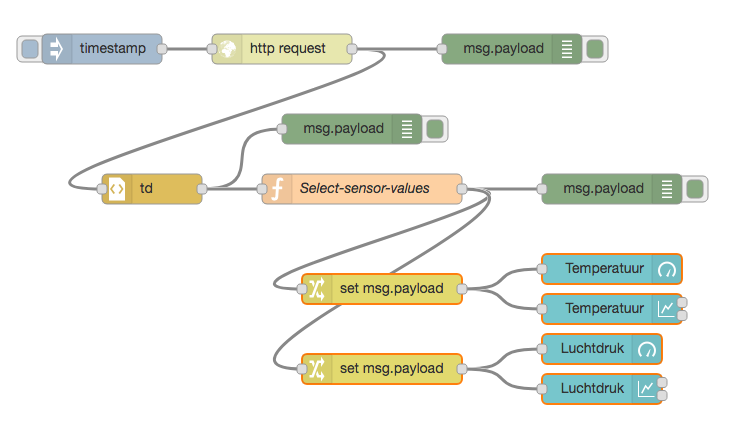

(*)Sensor-dashboard
-------------------

Met enige moeite kunnen we met NodeRed de (sensor)gegevens van een website halen en weergeven in een dashboard.
Hiervoor halen we een html-document op van een website (met een HTTP GET request),
vervolgens ontleden we dit document om de sensorgegevens eruit te halen.
Daarna geven we deze sensorgegevens weer in een dashboard.

.. figure:: Nodered-dashboard-display-0.png
   :width: 600 px
   :align: center

   NodeRed dashboard display

NodeRed biedt de bouwstenen voor het maken van een eenvoudig dashboard. We gebruiken in het voorbeeld de volgende knopen:

+--------------------+------------------+----------------+------------------------+
| **figuur**         | **naam**         | **soort**      | **betekenis**          |
+--------------------+------------------+----------------+------------------------+
| |dashboard-gauge|  | dashboard-gauge  |  output        | meter (actuele waarde) |
+--------------------+------------------+----------------+------------------------+
| |dashboard-chart|  | dashboard-chart  |  output        | grafiek (verloop)      |
+--------------------+------------------+----------------+------------------------+

.. |dashboard-gauge| image:: nodered-dashboard-gauge.png
.. |dashboard-chart| image:: nodered-dashboard-chart.png

Zie voor het installeren van deze nodes de NodeRed-inleiding (in Bouwstenen).

Om een dashboard te maken moeten we eerst de gegevens van de sensoren ophalen.
In dit geval (IoT-knoop als webserver) hebben we hierbij twee problemen:

* de IoT-knoop-webserver is alleen beschikbaar in het lokale netwerk.
  Dit betekent dat we het dashboard alleen via een computer in het lokale netwerk kunnen laten werken.
  Dit kan bijvoorbeeld een Raspberry Pi met NodeRed zijn.
* de gegevens zijn beschikbaar als HTML-document (tekst).
  Hierin moeten we de sensorgegevens zien te vinden.
  NodeRed heeft o.a. een html-node om elementen uit een HTML-document te selecteren.

Voor demonstratiedoeleinden gebruiken we hier een website die hetzelfde interface heeft als de IoT-knopen.
De website http://infvopedia.nl:1880/sensors is gekoppeld aan de hardware-IoT-knoop ``ec54``.
In het lokale netwerk zou je deze kunnen benaderen via ``http://esp8266-ec54.local/`` of via het IP-adres.

   Webserver dashboard flow

Uitleg bij deze flow:

* je start de flow door op de "inject"-knoop te klikken.
  (Dit kun je later automatiseren.)
* de volgende actie is het versturen van een HTTP GET-request,
  met als URL: ``http://infvopedia.nl:1880/sensors``
* het resultaat daarvan vind je via de debug-knoop in het debug-venster.
  Dit resultaat is een HTML-document (tekst).
* via de html-node selecteren we alle "td" elementen in deze tekst.
  het resultaat daarvan vind je weer in het debug-venster.
* we vullen de sensorwaarden in de payload in, als normale velden (``msg.payload.temperature``, enz.),
  via de functie *Select-sensor-values*.
* via de change-nodes zetten we de payload met de gewenste sensorwaarde,
  bijvoorbeeld ``set msg.payload to msg.payload.temperature``.
  (We zouden hiervoor ook een function-node kunnen gebruiken.)
* deze payload maken we zichtbaar via de dashboard-nodes.

De html-node die we hier gebruiken is handig voor het selecteren van elementen in een html-document.

In het debug-venster vind je de outputs van de verschillende debug-nodes.
Als je een output hierin selecteert, zie je van welke node deze afkomstig is.
Je kunt een debug-node tijdelijk uitzetten met de knop aan de rechterkant.
Je moet de veranderde flow dan wel activeren met de *deploy*-knop.

De functie *Select-sensor-values*:

.. code-block:: JavaScript

  var input = msg.payload;
  msg.payload = {};
  msg.payload.temperature = parseFloat(input[1]);
  msg.payload.barometer = parseFloat(input[3]);
  return msg;

Hieronder staat de flow in JSON-notatie.
Deze kun je met Copy-Paste overbrengen en vervolgens importeren in je NodeRed-editor.

.. code-block:: json

  [{"id":"9d733e0b.01778","type":"inject","z":"f5bf33f.ce9c85","name":"","topic":"","payload":"","payloadType":"date","repeat":"","crontab":"","once":false,"onceDelay":0.1,"x":120,"y":80,"wires":[["56b0445f.766c5c"]]},{"id":"56b0445f.766c5c","type":"http request","z":"f5bf33f.ce9c85","name":"","method":"GET","ret":"txt","url":"http://infvopedia.nl:1880/sensors","tls":"","x":300,"y":80,"wires":[["dba2f76f.d09588","da3db487.e2c9a8"]]},{"id":"dba2f76f.d09588","type":"html","z":"f5bf33f.ce9c85","name":"","property":"payload","outproperty":"payload","tag":"td","ret":"html","as":"single","x":170,"y":220,"wires":[["ec6a7f9b.10bca8","6b21f3b7.50e694"]]},{"id":"ec6a7f9b.10bca8","type":"debug","z":"f5bf33f.ce9c85","name":"","active":true,"tosidebar":true,"console":false,"tostatus":false,"complete":"false","x":370,"y":160,"wires":[]},{"id":"6b21f3b7.50e694","type":"function","z":"f5bf33f.ce9c85","name":"Select-sensor-values","func":"var input = msg.payload;\nmsg.payload = {};\nmsg.payload.temperature = parseFloat(input[1]);\nmsg.payload.barometer = parseFloat(input[3]);\nreturn msg;","outputs":1,"noerr":0,"x":380,"y":220,"wires":[["6491c42f.903274","8a35258e.865308","ee82ff5d.2ac73"]]},{"id":"6491c42f.903274","type":"debug","z":"f5bf33f.ce9c85","name":"","active":true,"tosidebar":true,"console":false,"tostatus":false,"complete":"false","x":630,"y":220,"wires":[]},{"id":"7db1e8a8.5d3ca8","type":"ui_gauge","z":"f5bf33f.ce9c85","name":"","group":"a4643fc8.e80d68","order":0,"width":0,"height":0,"gtype":"gage","title":"Temperatuur","label":"'C","format":"{{payload}}","min":0,"max":"50","colors":["#00b500","#e6e600","#ca3838"],"seg1":"","seg2":"","x":630,"y":300,"wires":[]},{"id":"9583a0a1.3f21e","type":"ui_chart","z":"f5bf33f.ce9c85","name":"","group":"6afe9bdf.976fec","order":0,"width":0,"height":0,"label":"Temperatuur","chartType":"line","legend":"false","xformat":"HH:mm:ss","interpolate":"linear","nodata":"","dot":false,"ymin":"0","ymax":"50","removeOlder":1,"removeOlderPoints":"","removeOlderUnit":"86400","cutout":0,"useOneColor":false,"colors":["#1f77b4","#aec7e8","#ff7f0e","#2ca02c","#98df8a","#d62728","#ff9896","#9467bd","#c5b0d5"],"useOldStyle":false,"x":630,"y":340,"wires":[[],[]]},{"id":"8a35258e.865308","type":"change","z":"f5bf33f.ce9c85","name":"","rules":[{"t":"set","p":"payload","pt":"msg","to":"payload.temperature","tot":"msg"}],"action":"","property":"","from":"","to":"","reg":false,"x":400,"y":320,"wires":[["9583a0a1.3f21e","7db1e8a8.5d3ca8"]]},{"id":"872c6883.661e3","type":"ui_gauge","z":"f5bf33f.ce9c85","name":"","group":"a4643fc8.e80d68","order":0,"width":0,"height":0,"gtype":"gage","title":"Luchtdruk","label":"units","format":"{{payload}}","min":"950","max":"1050","colors":["#00b500","#e6e600","#ca3838"],"seg1":"","seg2":"","x":620,"y":380,"wires":[]},{"id":"380c3cf1.a6ac94","type":"ui_chart","z":"f5bf33f.ce9c85","name":"","group":"6afe9bdf.976fec","order":0,"width":0,"height":0,"label":"Luchtdruk","chartType":"line","legend":"false","xformat":"HH:mm:ss","interpolate":"linear","nodata":"","dot":false,"ymin":"950","ymax":"1050","removeOlder":1,"removeOlderPoints":"","removeOlderUnit":"86400","cutout":0,"useOneColor":false,"colors":["#1f77b4","#aec7e8","#ff7f0e","#2ca02c","#98df8a","#d62728","#ff9896","#9467bd","#c5b0d5"],"useOldStyle":false,"x":620,"y":420,"wires":[[],[]]},{"id":"ee82ff5d.2ac73","type":"change","z":"f5bf33f.ce9c85","name":"","rules":[{"t":"set","p":"payload","pt":"msg","to":"payload.barometer","tot":"msg"}],"action":"","property":"","from":"","to":"","reg":false,"x":400,"y":400,"wires":[["872c6883.661e3","380c3cf1.a6ac94"]]},{"id":"da3db487.e2c9a8","type":"debug","z":"f5bf33f.ce9c85","name":"","active":true,"tosidebar":true,"console":false,"tostatus":false,"complete":"false","x":530,"y":80,"wires":[]},{"id":"a4643fc8.e80d68","type":"ui_group","z":"","name":"Web-meters","tab":"9c0984df.31b73","disp":true,"width":"6","collapse":false},{"id":"6afe9bdf.976fec","type":"ui_group","z":"","name":"Web-graphs","tab":"9c0984df.31b73","disp":true,"width":"6","collapse":false},{"id":"9c0984df.31b73","type":"ui_tab","z":"","name":"Web-dashboard","icon":"dashboard"}]

.. rubric:: Opdrachten

(a) gebruik van de flow

  * importeer de dashboard-flow in een lege flow-pagina
  * activeer deze flow (via deploy)
  * controleer de flow door op de inject-knop (in de flow) te klikken.
  * bekijk het dashboard:

(b) experiment 1: http-request

  * verwijder de link tussen de http-request-node en de html-node (``td``).
  * klik op de inject-knop, en bekijk de output van de debug-node: dit is een html-document.
  * pas de http-request node aan, voor een andere website naar keuze;
    en bekijk de html-code van die website.
  * herstel de oorspronkelijke flow (eventueel kun je alle knopen verwijderen en de flow opnieuw importeren)

(c) experiment 2: html-node

  * verwijder de link tussen de html-code (``td``) en *select-sensor-values*.
  * klik op de inject-knop, en bekijk de output van de debug-node van ``td``:
    dit is een array met alle ``td``-elementen in het html-document.
  * configureer de html-node: verander de selector in ``h1`` of ``p``.
  * controleer of je nu de overeenkomstige elementen uit het html-document krijgt.
  * herstel de oorspronkelijke flow.

(d) experiment 3: herhaald opvragen van sensordata

  * configureer de inject-node: verander de "Repeat" in "Interval";
  * vul als waarde voor het interval in: 30 seconden;
  * ga na (aan de hand van de grafiek in het dashboard) of je dit interval ook groter kunt maken.

**Opmerkingen**

* html-documenten zijn niet erg handig om data van een server te halen.
  Een formaat dat in veel website-API's gebruikt wordt is JSON:
  dat komt in het volgende hoofdstuk aan de orde.
* tegenwoordig maken websites het steeds lastiger om data uit het html-document te halen,
  bijvoorbeeld doordat deze data pas op het laatste moment ingevuld wordt vanuit javascript.
  Je kunt het geluk hebben dat zo'n website een JSON-API heeft, anders heb je pech.
* (Het FRED-voorbeeld van de Google Finance website werkt niet meer,
  en Google heeft de finance-API gedeactiveerd.)
* het herhaald opvragen van de sensorwaarden door de client bij de (web)server heet "polling".
  Dit is geen handige aanpak: je krijgt veel onnodige communicatie, zeker als de sensorwaarden niet veranderen.
  Het is handiger als de IoT-knoop deze waarden opstuurt als ze veranderd zijn:
  een aanpak daarvoor zien we in het volgende hoofdstuk.

.. todo::

  * gebruik van inject-node om led te laten knipperen
    (nb: we hebben dan wel een webserver-knoop in het publieke internet nodig, of tenminste een gesimuleerde versie daarvan).
  * gebruik van schedule-node om led via tijd te besturen
  * opdracht: maak met NodeRed een website/dashboard dat weergeeft of je morgen het eerste uur vrij hebt.
    (...als de rooster-website van je school dit mogelijk maakt...)
