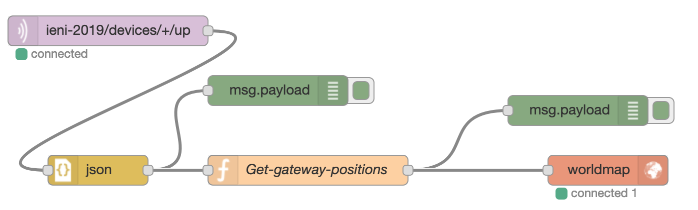

NodeRed-opdrachten
==================
.. admonition:: Wat heb je nodig?

  * de Application-ID en een Access key (API-key) een bestaande TTN-toepassing
    (application) met actieve IoT-knopen (via je docent);
  * een (gratis) FRED-account, of andere NodeRed-server.
  * alleen voor de gevorderde opdrachten:

    * een (gratis) TTN-account, en
    * een eigen LoRaWan-device.

Ontvangen van TTN data in NodeRed
---------------------------------

.. figure:: images/iot-ttn-mqtt-flow.png
  :width: 550px
  :align: center

  Flow voor het ontvangen van TTN-data

Maak de bovenstaande flow in NodeRed.
Instellingen voor de MQTT input node:

* server (broker):

  * connection-server: ``eu.thethings.network``
  * security-username: ``my-app-id``, -password: ``my-api-key``

* topic: ``my-app-id/devices/my-dev-id/up``,

Hierin vervang je ``my-app-id`` door de Application-ID (de unieke naam),
``my-api-key`` door de Access key (API-key),
en ``my-dev-id`` door de Device-ID (de unieke naam).
Je kunt in het topic in plaats van my-app-id ook ``+`` gebruiken,
als wildcard voor alle devices.

Vergeet **Deploy** niet!

Na enige tijd zie je als alles goed is de data in het debug-venster verschijnen.
(De berichten worden om de paar minuten verstuurd.)

Vragen:

1. met welke datarate (SF, bandbreedte) is het bericht verstuurd?
2. door hoeveel gateways is het bericht ontvangen? Met welke signaalsterktes?
3. kun je op grond van de signaalsterktes en de posities van de gateways iets zeggen over de locatie van het IoT-device?

*Opmerking.* Er zijn ook speciale TTN-nodes in NodeRed,
deze zijn nog wat eenvoudiger in het gebruik, maar worden niet meer onderhouden.

Nodered-TTN-Dashboard
---------------------

Met NodeRed maak je een dashboard voor de sensordata van een Lora/TTN IoT-knoop.
Je gebruikt MQTT voor het dataverkeer met TheThingsNetwork.

.. figure:: images/iot-ttn-dashboard-flow.png
  :align: center
  :width: 550px

  Dashboard-flow voor TTN

* kopieer de onderstaande NodeRed-flow, en importeer deze naar een leeg tabblad in NodeRed.

Download: :download:`ttn-dashboard-flow.json<./ttn-dashboard-flow.json>`

.. code-block:: json

* configureer de MQTT input node zoals in de vorige opdracht ;
* configureer de debug-node, met output: complete msg object
* "Deploy".

Je ziet nu (als het goed is) in het bijbehorende dashboard-tab "TTN dashboard" de gegevens van de IoT-knoop verschijnen.
Dit kan even duren, omdat een TTN IoT-knoop met tussenperioden van enkele minuten zendt.

Via de debug-node kun je de metadata van de communicatie tussen de IoT-knoop en de gateway volgen.
Een voorbeeld hiervan zie je hieronder:

.. figure:: images/iot-ttn-metadata.png
  :width: 300px
  :align: center

  Metadata voor TTN-LoRaWan-communicatie

Beantwoord de onderstaande vragen aan de hand van de metadata in het debug-venster.

1. welke gateway(s) ontvangen de berichten van deze IoT-knoop(en)?
2. welke SF wordt gebruikt?
3. wat is de (geschatte) *air time* van de berichten?

Gateways op de kaart
--------------------

De meeste gateways geven hun eigen positie door (latitude, longitude).
We kunnen de positie van de gateways die een bericht ontvangen hebben,
op een kaart weergeven.
We gebruiken daarbij een web-dienst om kaarten in webpagina's te tonen.
De ``worldmap``-nodes maken het gebruik daarvan erg gemakkelijk.
Zie: https://www.npmjs.com/package/node-red-contrib-web-worldmap.
Je installeert deze nodes:

* in de normale NodeRed-installatie: via het hamburgermenu rechtsboven,
  "Manage Pallette"; en dan bij Install zoeken naar "worldmap"; en dan Install.
* in een FRED-installatie: FRED-menu links, "Add or Remove Nodes",
  zoeken maar "worldmap"; en dan aanvinken.

We gebruiken de onderstaande flow:

  Flow voor het weergeven van gateways op een kaart.

We gebruiken een functie om de metadata van een bericht om te zetten
in een payload voor deze worldmap-node.
We laten de functie een array met een array van coördinaten opleveren:
dit resulteert in een reeks van nodered-messages naar de worldmap-node.
Zie ook: https://nodered.org/docs/user-guide/writing-functions#multiple-messages

De JavaScript-functie ziet er als volgt uit:

.. code-block:: JavaScript

  var gateways = msg.payload.metadata.gateways;
  var result = []
  for (var g of gateways) {
      result.push({payload: {
                    lat: g.latitude,
                    lon: g.longitude,
                    name: g.gtw_id,
                    rssi: g.rssi,
                    device: msg.payload.dev_id
      }});
  }
  result.push({payload: {
      command: {lat: gateways[0].latitude,
                lon: gateways[0].longitude,
                zoom: 16
  }}});
  return [result];

..

Je kunt de flow importeren vanuit de onderstaande JSON-tekst:

(download: :download:`ttn-map-flow.json <./ttn-map-flow.json>`)

..

Opdrachten:

1. Maak bovenstaande flow werkend: je vindt de kaart via het ``/worldmap``-pad
   in plaats van het dashboard-pad, bijvoorbeeld: ``https://hans.fred.sensetecnic.com/api/worldmap``
   (voor een FRED installatie).
2. door voor het punt een "radius"-waarde mee te geven, in meters, wordt er rond de gateway een (gevulde)
   cirkel getekend (zie https://www.npmjs.com/package/node-red-contrib-web-worldmap#circles-and-ellipses).
   Je kunt deze straal af laten hangen van de rssi: hoe negatiever de waarde van rssi,
   des te groter de afstand tot de gateway - en des te groter de cirkel.
   Voeg deze cirkels toe, als hulp om te bepalen waar de IoT-devices zich ten opzicht van de gateways
   bevinden. *Opmerking* de signaalsterkte rssi hangt niet alleen af van de afstand,
   maar ook van de obstakels tussen het IoT-device en de gateway.
   Een hoger geplaatste gateway heeft meestal minder obstakels,
   en geeft een grotere signaalsterkte (minder negatieve rssi).
