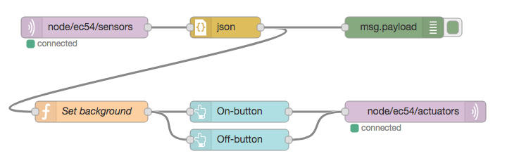

LED-afstandsbediening
---------------------

Met de NodeRed UI-nodes maak je een web-interface om de LED van een IoT-knoop aan- en uit te zetten.

   NodeRed remote led control

Uitleg bij deze flow:

* we gebruiken de function-node om de achtergrondkleur van de knoppen aan te passen:
  rood als de led brandt, blauw als deze niet brandt.

.. code-block:: JavaScript

  if (msg.payload.payload[0].dOut == 1) {
      msg.background = "red";
  } else {
      msg.background = "blue";
  }
  return msg;

* ``msg.payload`` is hier het MQTT-JSON-bericht;
  dit is een object met als ``payload`` de sensorgegevens in LPP-formaat;
* ``payload[0]`` geeft de toestand van LED0 weer;
* de on-button maakt (bij indrukken van de knop) een JSON-bericht aan: ``{"0":{"dOut":1}}``
* de off-button maakt een JSON-bericht aan:  ``{"0":{"dOut":0}}``
* de MQTT-output-node verstuurt dit bericht via de broker naar de IoT-knoop.

De flow:

.. code-block:: json

  [{"id":"c86ee84d.ba74e8","type":"mqtt out","z":"c5998a3b.3a8cd8","name":"","topic":"node/ec54/actuators","qos":"","retain":"","broker":"a71c1cf9.dcd1c","x":680,"y":240,"wires":[]},{"id":"d6461459.c6e21","type":"ui_button","z":"c5998a3b.3a8cd8","name":"On-button","group":"ac1fc815.5c1368","order":0,"width":0,"height":0,"passthru":false,"label":"On","color":"","bgcolor":"{{msg.background}}","icon":"","payload":"{\"0\":{\"dOut\":1}}","payloadType":"json","topic":"node/ec54/actuators","x":430,"y":240,"wires":[["c86ee84d.ba74e8"]]},{"id":"29557457.4d4734","type":"ui_button","z":"c5998a3b.3a8cd8","name":"Off-button","group":"ac1fc815.5c1368","order":0,"width":0,"height":0,"passthru":false,"label":"Off","color":"","bgcolor":"{{msg.background}}","icon":"","payload":"{\"0\":{\"dOut\":0}}","payloadType":"json","topic":"node/ec54/actuators","x":430,"y":280,"wires":[["c86ee84d.ba74e8"]]},{"id":"6e55f1d8.49d9d","type":"mqtt in","z":"c5998a3b.3a8cd8","name":"","topic":"node/ec54/sensors","qos":"2","broker":"a71c1cf9.dcd1c","x":210,"y":120,"wires":[["5971a318.cee434"]]},{"id":"5971a318.cee434","type":"json","z":"c5998a3b.3a8cd8","name":"","property":"payload","action":"","pretty":false,"x":410,"y":120,"wires":[["cb9d5ef5.0ac258","ef6cae81.13708"]]},{"id":"cb9d5ef5.0ac258","type":"function","z":"c5998a3b.3a8cd8","name":"Set background","func":"if (msg.payload.payload[0].dOut == 1) {\n    msg.background = \"red\";\n} else {\n    msg.background = \"blue\";\n}\nreturn msg;","outputs":1,"noerr":0,"x":220,"y":240,"wires":[["d6461459.c6e21","29557457.4d4734"]]},{"id":"ef6cae81.13708","type":"debug","z":"c5998a3b.3a8cd8","name":"","active":true,"tosidebar":true,"console":false,"tostatus":false,"complete":"false","x":650,"y":120,"wires":[]},{"id":"a71c1cf9.dcd1c","type":"mqtt-broker","z":"","name":"","broker":"localhost","port":"1883","clientid":"","usetls":false,"compatmode":true,"keepalive":"60","cleansession":true,"birthTopic":"","birthQos":"0","birthPayload":"","willTopic":"","willQos":"0","willPayload":""},{"id":"ac1fc815.5c1368","type":"ui_group","z":"","name":"ec54-LED","tab":"82f77921.e05dc","disp":true,"width":"6","collapse":false},{"id":"82f77921.e05dc","type":"ui_tab","z":"","name":"ec54","icon":"dashboard"}]
