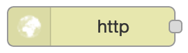
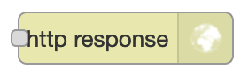

Voorbereiding
-------------

Lees als voorbereiding op de NodeRed-opdrachten eerst onderstaande tekst.
Doe dit bij voorkeur met een geopende versie van NodeRed,
zodat je de verschillende onderdelen direct kunt vinden en uitproberen.

**Nodes en knopen**: om verwarring te voorkomen gebruiken we in deze opdrachten het woord "knoop" voor een IoT-knoop,
en "node" voor een NodeRed-node.

.. admonition:: Handleiding en video's

  De volgende Engelstalige video's kunnen je helpen bij dit materiaal:

  * NodeRed Fundamentals: https://www.youtube.com/watch?v=3AR432bguOY
  *	NodeRed export en import: https://www.youtube.com/watch?v=V0SmNcIYCtQ

  Officiële gebruikershandleiding (Engelstalig):

  * NodeRed first flow: https://nodered.org/docs/tutorials/first-flow
  * NodeRed concepten: https://nodered.org/docs/user-guide/concepts
  * NodeRed editor, met video's: https://nodered.org/docs/user-guide/editor/

  Deze gebruikershandleiding bevat veel nuttige details voor een handig gebruik van NodeRed.

  Opmerking: de video's zijn Engelstalig, en sommige hebben een vrij hoog tempo.
  Om een video beter te kunnen volgen kun je met de YouTube tandwiel-knop
  (i) het tempo van de video aanpassen (bijvoorbeeld 0.75);
  (ii) de automatische ondertiteling inschakelen;
  en (iii) de automatische vertaling inschakelen ("knooppuntrood").
  En je kunt een video altijd stil zetten en opnieuw afspelen.

Nodes en flows
^^^^^^^^^^^^^^

.. figure:: nodered-hello.png
   :width: 600 px
   :align: center

   NodeRed http flow-voorbeeld

Een *flow* in NodeRed bestaat uit een netwerk van *nodes* en *verbindingen*.
Het aansluitpunt (bolletje) aan de linkerkant van een node is de input.
Een node zonder aansluiting links is een *input-node*, met een externe input, bijvoorbeeld een http-request.
De outputs staan aan de rechterzijde van de node.
Een node zonder aansluiting rechts is een *output-node*, met een externe output, bijvoorbeeld een http-response.

Een NodeRed-toepassing kan uit meerdere flows bestaan: elke flow heeft een eigen pagina (tab).

+--------------------+------------------+------------------+
| **figuur**         | **naam**         | **soort node**   |
+--------------------+------------------+------------------+
| |http-input-node|  | http-input-node  |  input           |
+--------------------+------------------+------------------+
| |http-output-node| | http-output-node |  output          |
+--------------------+------------------+------------------+
| |template-node|    | template-node    |  in-out          |
+--------------------+------------------+------------------+

.. |template-node| image:: nodered-template-node.png

**Hoe werkt een flow?**
Als een node een bericht (message) krijgt via de input,
dan voert deze node daarop een bewerking uit,
en genereert één of meer messages naar de output(s).
Deze output is weer verbonden  met de input van een andere node;
of de node is een output-node, met een externe output.

*Voor het bovenstaande flow-voorbeeld*: (i) de http-input-node ontvangt een http-request als
de http-method gelijk is aan ``get`` en het URL-pad gelijk is aan ``/hello``.
Deze http-input-node stuurt dan een message met dit request naar
(ii) de template-node ``hello.html``.
Deze genereert de bijbehorende output: een html-document,
en stuurt een message met dit document naar
(iii) de http-output-node, die uit de message de bijbehorende response samenstelt.
Deze node stuurt de response naar de afzender van het http-request.

NodeRed UI
^^^^^^^^^^

.. figure:: nodered-ui.png
   :width: 800 px
   :align: center

   NodeRed user interface

In het NodeRed user interface vind je helemaal bovenin de **Deploy**-knop en het "hamburger" **menu** (drie streepjes).
Daaronder, van links naar rechts:

* het node-**palette**. Uit dit palette selecteer je nodes die je wilt gebruiken.

  Er zijn onder andere input-nodes (met een bolletje rechts),
  output-nodes (met een bolletje links), en function-nodes (met links en rechts een bolletje).
  Er zijn nodes voor allerlei protocollen, bijvoorbeeld: HTTP, TCP, MQTT.
  Er zijn ook nodes voor communicatie met toepassingen als bijvoorbeeld Twitter.

* het **flow-venster**. Dit bestaat uit verschillende flow-tabs.

  * Met "+" maak je een nieuwe flow-tab aan.
  * Door double-click op de flow-naam krijg je het configuratie-venster voor deze flow te zien.
    Hiermee kun je de flow hernoemen, tijdelijk uitschakelen (disable), of verwijderen (delete).

* de **info/debug/dashboard-sidebar**

  * de info-tab geeft informatie over de geselecteerde node in het flow-gedeelte.
  * de debug-tab geeft de debug-output van de huidige flow, of van alle flows.
  * via de dashboard-tab kun je de UI-instellingen van het dashboard veranderen.

In het FRED-venster vind je helemaal links de **FRED-sidebar**;
met het pijltje linksonder maak je deze (on)zichtbaar.

De volgende oefeningen zijn bedoeld om vertrouwd te raken met het user interface.
Deze oefeningen hebben geen effect op de flows zelf.

.. rubric:: Oefenen met het NodeRed interface

* klik op het hamburgermenu, en zoek de instellingen voor:

  * het (on)zichtbaar maken van de sidebar (info/debug/dashboard)
  * het importeren van flows (vanuit het Clipboard)
  * het zichtbaar maken van de tab met configuratie-nodes

* zoek in het palette:

  * HTTP input-node
  * MQTT output-node
  * Twitter output-node

* voeg een nieuwe flow-tab toe (via "+")

  * hernoem deze tot "Test-flow"

* (alleen voor FRED):

  * maak de FRED-sidebar (links) onzichtbaar en weer zichtbaar

Dashboard-nodes installeren
^^^^^^^^^^^^^^^^^^^^^^^^^^^

De dashboard-nodes zijn niet altijd beschikbaar in het node-palet links.

**Als je FRED gebruikt**, dan installeer je de dashboard-nodes als volgt:

* selecteer in de FRED-zijbalk (helemaal links): Tools-> add or remove nodes
* type in het zoekveld: dashboard
* vink aan: *Dashboard (a set of dashboard nodes for NodeRed)*.

**Voor een normale NodeRed-installatie** gebruik je de volgende stappen:

* selecteer hamburger-menu (rechts) -> Manage Palette
* selecteer de tab *Install*
* type in het zoekveld: dashboard
* klik op "install" voor *node-red-dashboard* *(A set of dashboard nodes for Node-RED)*
* na deze installatie zijn de nodes in het palet links beschikbaar.
