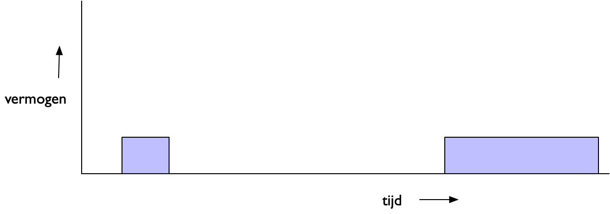

Energie en vermogen
-------------------

    Energie en vermogen

In de figuur hierboven zie je de relatie tussen energie en vermogen:

:math:`\it{\text{energie} = \mbox{vermogen} \times \text{tijd}}`.

Het vermogen staat op de vertical as, de tijd op de horizontale:
de energie is het oppervlak onder de grafiek.
Dit verband kom je een aantal malen tegen bij IoT-knopen en IoT-radio's.

.. rubric:: Kiezen tussen grotere bitsnelheid of groter bereik

IoT-knopen werken meestal in radiobanden met beperkingen;
bijvoorbeeld, in de 868 MHz licentievrije band is het maximale zendvermogen 25 mW (14dB).

Als je het bereik van een radio wilt vergroten,
zonder aan de frequentie, het vermogen of de antenne te sleutelen,
heb je *meer energie per bit* nodig.
Als het vermogen vastligt, dan betekent dit dat de tijdsduur van een bit groter moet worden:
energie (per bit) = vermogen * tijd (per bit).
Met andere woorden, je krijgt een lagere bitsnelheid (minder bits/sec).

Dit effect zie je onder meer bij LoRa:
je kunt daar in een aantal stappen kiezen voor een hogere bitsnelheid (met een kleiner bereik),
of voor een groter bereik (met een lagere bitsnelheid).

.. rubric:: Korte berichten gebruiken minder energie

Een lagere bitsnelheid heeft nog een ander effect:
de duur van de berichten neemt toe.
Als een bericht tweemaal zo lang duurt, verdubbelt de energie voor het verzenden van dit bericht
(energie = vermogen * tijd).
Dit betekent dat de batterij sneller leegraakt.
Voor radio's met een lage bitsnelheid maak je daarom de berichten zo kort
mogelijk, bijvoorbeeld door een binaire codering te gebruiken.
Het versturen van veel tekst is in zo'n geval niet handig.

.. rubric:: Slapende IoT-knopen hebben een langere batterij-levensduur

Om de batterij van een IoT-knoop lang mee te laten gaan,
probeer je om deze IoT-knoop zoveel mogelijk in de "slaap"toestand te houden,
met minimaal vermogen.
Alleen tijdens de waak-periodes worden dan de sensoren uitgelezen en berichten verstuurd en ontvangen,
wat veel meer vermogen vraagt.
Het aantal waakperiodes en radioberichten en de duur van deze berichten probeer je zoveel mogelijk te beperken.

https://www.disk91.com/2017/technology/sigfox/all-what-you-need-to-know-about-regulation-on-rf-868mhz-for-lpwan/
